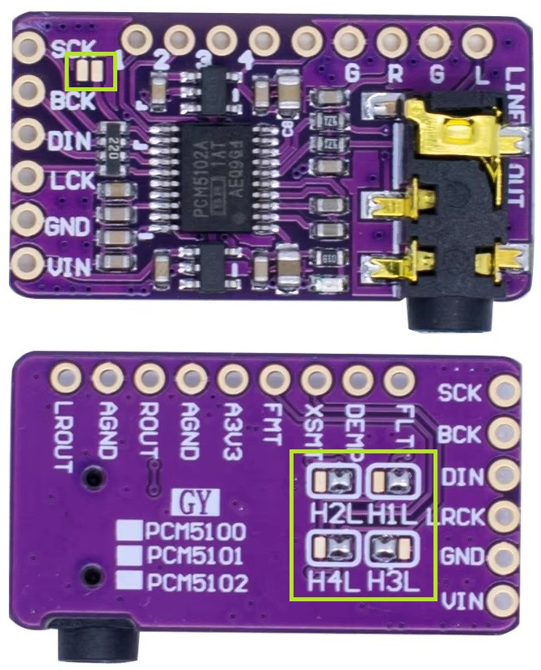

# MP3Player
---

MP3 плеер на основе МК RP2040.

# Зависимости

- **TFT_eSPI** - 
- **GyverEncoder** -
- **SD Card** - 
- **PCM5102** -
- **TDA7419** - Аудиопроцессор TDA7419

# Настройка библиотеки TFT_eSPI

Основные настройки выглядят так:

```cpp
#define USER_SETUP_ID 2

#define ST7735_DRIVER
#define TFT_WIDTH  128
#define TFT_HEIGHT 160

#define ST7735_REDTAB
#define TFT_RGB_ORDER TFT_RGB 

#define TFT_CS 15 
#define TFT_DC 16   
#define TFT_RST 17
#define TFT_SDA 19
#define TFT_SCL 18

#define TFT_MOSI 19
#define TFT_SCLK 18

#define LOAD_GLCD   
#define LOAD_FONT2  
#define LOAD_FONT4  
#define LOAD_FONT6  
#define LOAD_FONT7  
#define LOAD_FONT8  
#define LOAD_GFXFF  

#define SMOOTH_FONT

#define SPI_FREQUENCY  27000000

#define SPI_TOUCH_FREQUENCY  2500000
```


# Подключение аппартных компонентов

## Кнопки

Для экономии пинов и возможности использования большого количества кнопок выбран вариант с 
аналоговыми кнопками. Это означает, что кнопки при нажатии замыкают разные секции делителя напряжения и на 
выходном пине в зависимости от того, какая кнопка нажата, будет разное напряжение. 
Это напряжение нужно измерить и в зависимости от его величины вызвать ту или иную секцию кода.

|RP2040|Кнопки|Описание|
|------|------|--------|
|  29  | Выход|Измеряемое напряжение|

## Энкодер

|RP2040|Энкодер|Описание|
|------|-------|--------|
|      |       |        |

## Дисплей

Дисплей подключен к шине **SPI0**.

Возможные варианты подключения:

- **RX (MISO)**: GPIO 0, 4, 16
- **TX (MOSI)**: GPIO 3, 7, 19
- **SCK (Тактирование)**: GPIO 2, 6, 18
- **CSn (Выбор устройства)**: GPIO 1, 5, 17, 20

Текущее подключение:

|RP2040|Дисплей      |Описание       |
|------|-------------|---------------|
|  15  | CS          | Выбор чипа    |
|  16  | A0/DC       | Данные/команд |
|  17  | RESET       | Сброс         |
|  18  | SCK         | Тактирование  |
|  19  | SDA/MOSI/TX | Данные        |
|  GND | GND         | Земля         |
|  3.3 | VCC         | Питание       |

## SD Card

Возможные варианты подключения:

- **RX (MISO)**: GPIO 8, 12, 28
- **TX (MOSI)**: GPIO 11, 15
- **SCK (Тактирование)**: GPIO 10, 14
- **CSn (Выбор устройства)**: GPIO 9, 13

Текущее подключение:

SD-карта подключена к шине **SPI1**.

|RP2040|SD Card    |Описание|
|------|-----------|--------|
|  12  | MISO (RX) | Приём данных |
|  13  | CS        | Выбор устройства |
|  14  | SCK       | Тактирование |
|  15  | MOSI (TX) | Отсылка данных |

Не забываем, что у **RP2040** и карты должна быть общяя земля GND.

## DAC PCM5102

**DAC PCM5102** подключен к аппаратной шине **I2C**.

В следующей таблице приведена схема соединения PCM5102 и Raspberry Pi.

|RP2040|DAC PCM5102|Описание|
|------|-----------|--------|
|  26  | BCLK (BCK | I2S bit clock |
|  27  | WCLK (LCK)| I2S word select |
|  28  | DOUT (DIN)| I2S данные |
| 3.3V | A3V3      | Питание 3.3 В|

**Внимание!** Для питания модуля необходимо обеспечить 2 напряжения:

- **3.3 В** для цифровой части;
- **5 В** для аналоговой части.

Оба этих напряжения можно взять с платы **RP2040**. Как бы вы его не подключали, не забываем, 
что у **RP2040** и **PCM5102** должна быть общяя земля GND.

### Настройка модуля DAC PCM5102 с помощью перемычек

На обратной стороне платы модуля расположены 4 группы перемычек, 
которые позволяют выполнить его настройку. Каждая из групп состоит из 3 контактов, 
средний из которых подключен к пину модуля, а два других - к питанию 3.3В (**H**igh) и к земле GND (**L**ow).
Запаивая перемычки, можно подключить пин либо к земле, либо к питанию 3.3.В. 

Ещё одна перемычка **CLK** находится рядом с пином **CLK** на стороне монтажа. Если перемычка отсутствует
(встречаются и такие модули), то нужно просто соединить пин **CLK** с землёй GND.



На рисунке контрастным цветом обведены упомянутые выше перемычки. Перемычка **CLK** на рисунке не запаяна, её нужно запаять.

В таблице приведена конфигурация, которую нужно выставить с помощью запаивания перемычек.

|Перемычка|Пин PCM5102 |Значение      |
|---------|------------|--------------|
| H1L     | FLT        | Low - GND    |
| H2L     | DEMP       | Low - GND    |
| H3L     | XMST       | High - 3.3V  |
| H4L     | FMT        | Low - GND    |
| CLK     | CLK        | Low - GND    |

**Внимание!** После распайки нужно с помощью тестера убедиться, что: 

- каждый из пинов подтянут к нужнму полюсу питания;
- нет короткого замыкания мужду полюсами.

Первое позволит избежать проблем с воспроизведением звука, а второе - повреждения модуля питания.

## Аудиопроцессор TDA7419

Аудиопроцессор **TDA7419** питается рекомендованным напряжением 8.5 В от отдельного источника питания.
Но не забываем, что у **RP2040** и **TDA7419** должна быть общяя земля GND.

Микросхема аудиопроцессора **TDA7419** подключена к шине **I2C0**: 
                                   
|RP2040|TDA7419    |Описание|
|------|-----------|--------|
| 0    | SDA       | Данные |
| 1    | SCA       | Тактирование|


# Шрифты

Для создания шрифтов был использован инструмент **TFT_eSPI/Tools/Create_Smooth_Font/Create_font/Create_font.pde**  из состава библиотеки **TFT_eSPI**.
Это скрипт **Processing** - системы разработки, которую можно свободно скачать с сайта [processing.org](https://processing.org).

Что умеет скрит?
Как с ним обращаться?
Как использовать шрифт?

# Изображения в формате XBM

О формате **XBM** можно почитать здесь [X BitMap](https://ru.wikipedia.org/wiki/X_BitMap)

Онлайн-конвертор изображений в формат **XBM**: [Онлайн-конвертор](https://www.online-utility.org/image/convert/to/XBM)

Онлайн-редактор изображений в формат **XBM**: [Онлайн-редактор](https://www.lddgo.net/en/string/xbm-editor) 

**Внимание!** При генерации данных нужно выбрать **Endian = Little Endian**.


